# KimHardaNeApp

A Windows app for hosting quiz nights in the style of *Nə? Harada? Nə zaman?* (What? Where? When?). Players
answer on their phones, the TV shows the questions, a countdown and the leaderboard, and the host runs the
game from the app. Bring your own questions or use the bundled question bank.

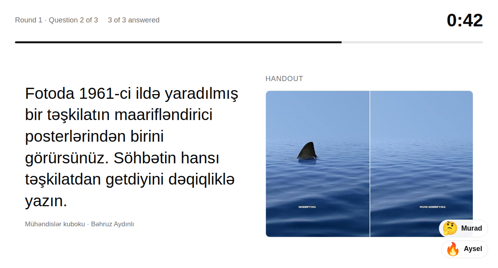

## Features

- **Party mode**: players join by scanning a QR code, with nothing to install. The TV shows each question with
  its pictures, a countdown with sound for the last 10 seconds, the answer with everyone's result, and the
  leaderboard. Typed answers are checked by a local AI model, or marked by the host when AI search is off,
  and the host can overrule any verdict.
- **Any TV**: a TV window on a second screen, Miracast, or the web browser of a Samsung Smart TV.
- **Host controls**: points for right and wrong answers, pause, autoplay, several rounds with or without
  keeping the scores, and no question shown twice in one party.
- **Your own questions**: write them on the *My questions* page, add a handout picture and an answer picture,
  collect them in lists and play a list in order.
- **Game helper and solo play**: a timer for the host, or play alone and mark your answers yourself or let the
  AI check them.
- **Question bank**: search by keyword or by meaning, ignoring case, diacritics and small typos, and edit
  any question. Works offline. Night mode included.

## Party mode

| Host (the app) | TV | Phone |
|---|---|---|
| 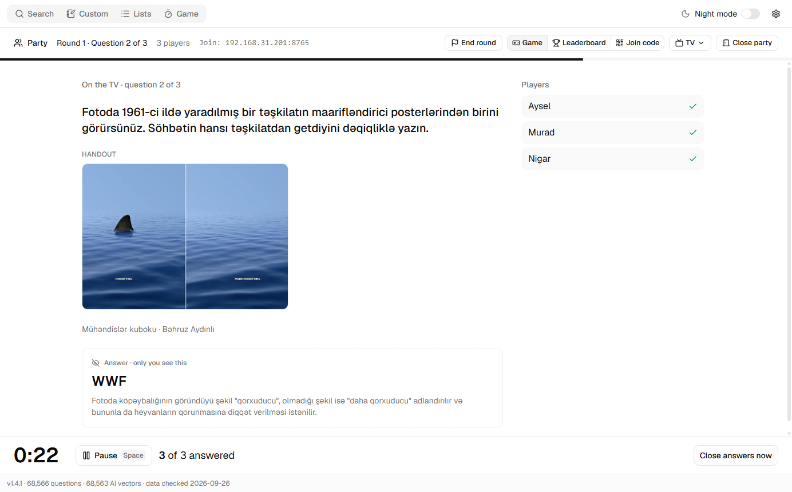 |  | 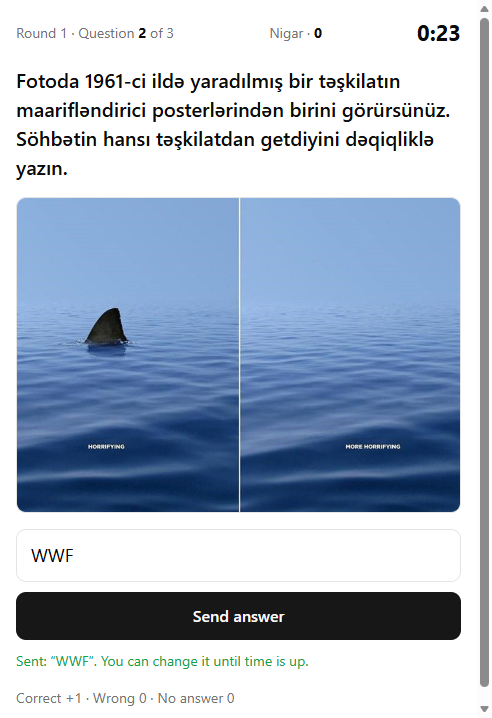 |
| 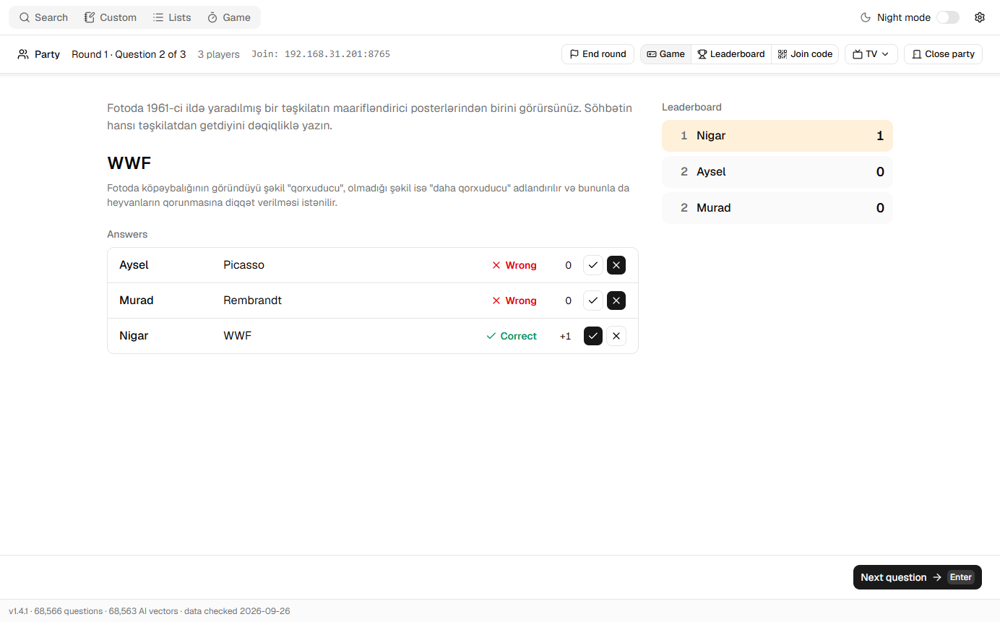 | 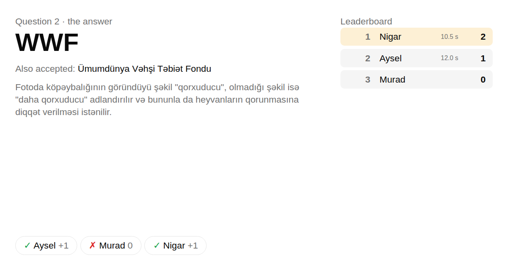 | 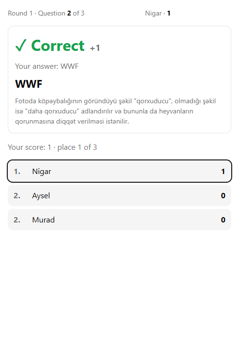 |

1. Optional: open **Settings** and turn on AI search to check the answers automatically. Without it, you mark
   each answer.
2. In the **Game** tab pick **Party**, then **Open party**. The TV window opens with the join code.
3. Put the TV window on the TV: drag it there and press F11, or use **TV → Show on Samsung TV…** or
   **TV → Cast with Miracast…**.
4. Players scan the QR code on the same Wi-Fi and type a name.
5. Pick the questions and start the round. Turn on **Autoplay** to move on by itself.

The app window stays the host's console: only the host sees the answer before the reveal, and phones and
the TV never receive it early.

## More screenshots

| | |
|---|---|
| 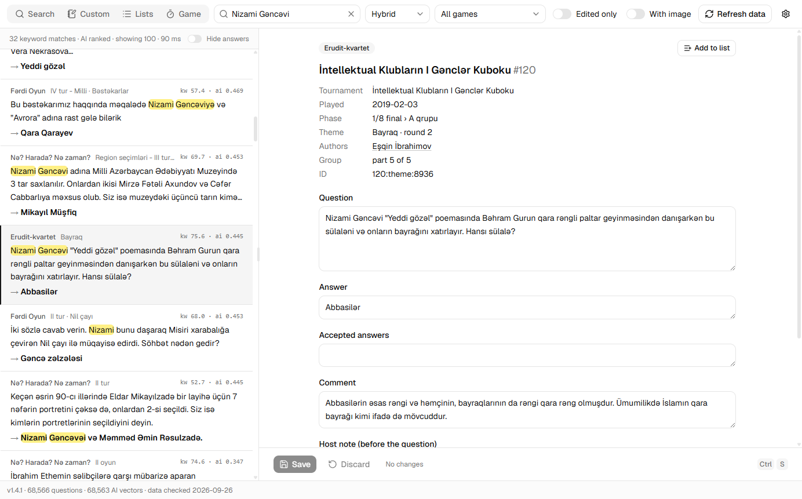 | 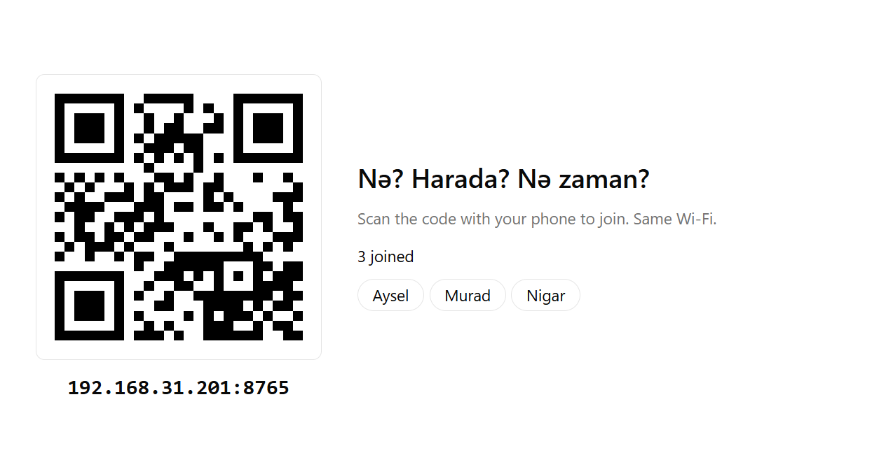 |
| 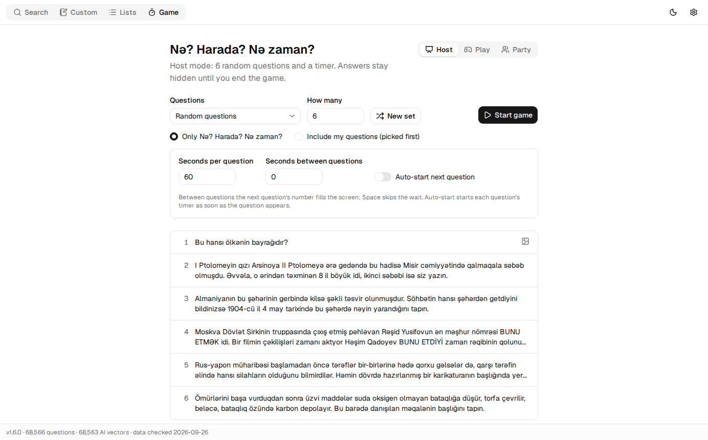 | 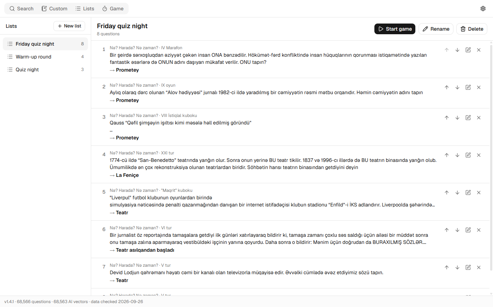 |
| 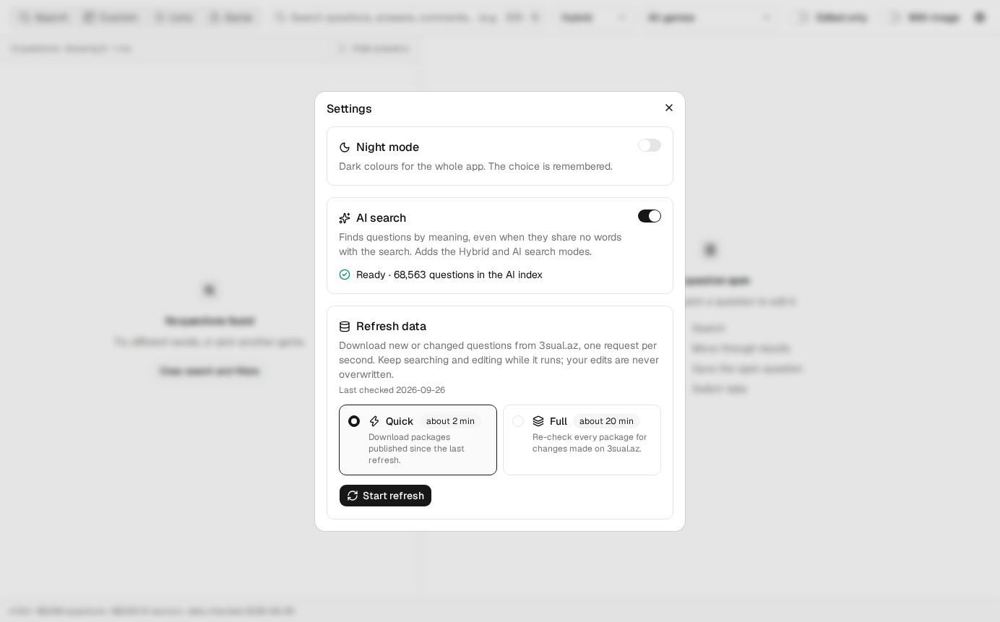 | 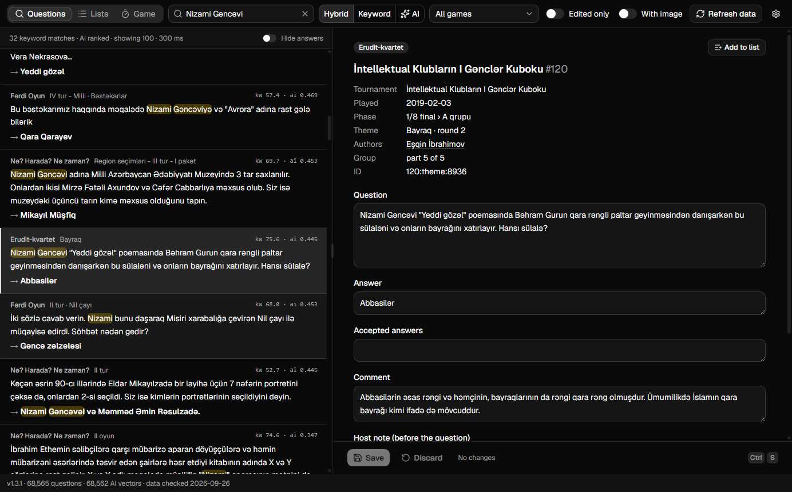 |

## Install

Download `KimHardaNeApp-Setup-<version>.exe` from
[Releases](https://github.com/The-Hasanov/KimHardaNeApp/releases) and run it. The installer is not
code-signed, so Windows SmartScreen warns on the first install: choose **More info → Run anyway**.

Windows Firewall asks once whether KimHardaNeApp may accept connections on private networks. Allow it, or
phones cannot join a party.

## Question bank

The installer comes with about 68,000 Azerbaijani questions from [3sual.az](https://3sual.az/), collected
from its public API by the included scraper (*Refresh data* in the app fetches new ones). The questions
belong to their authors and to 3sual.az. Your own questions and edits are kept apart from refreshes and
updates.

## Build from source

The question database is not in this repository. The scraper builds it (about 20 minutes, one request per
second).

```bash
cd app
npm install
node scraper.js crawl --db ../data/3sual.sqlite
node scraper.js images --db ../data/3sual.sqlite   # optional, for offline images (~35 min)
npm start
```

Requires Node 22.5+. Other commands:

```bash
npm test          # offline tests
npm run dist      # Windows installer in app/dist
```

## Documentation

- [How the app works](docs/app.md): party and game modes, your own questions, search and editing, the
  installer and updates, and the search benchmark.
- [The scraper](docs/scraper.md): options, API endpoints, the SQLite schema, the JSONL export and the
  completeness checks.

## License

The code is under the [MIT License](LICENSE). The bundled questions are not: they belong to their authors
and 3sual.az.
